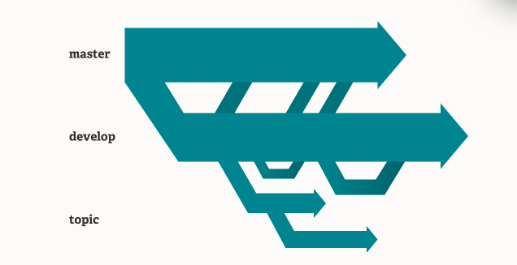
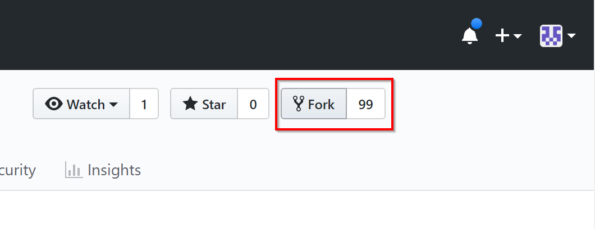
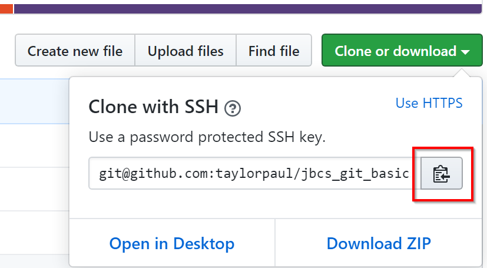
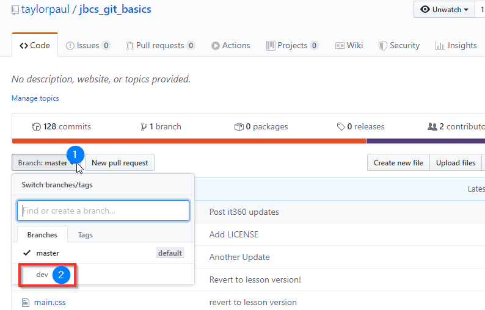
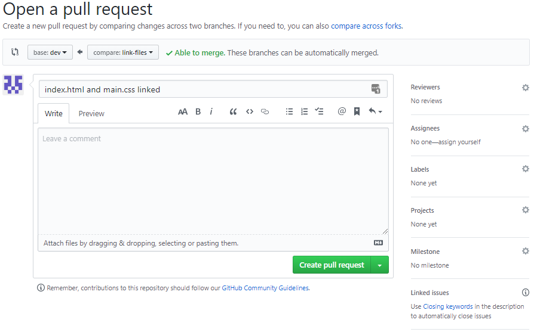
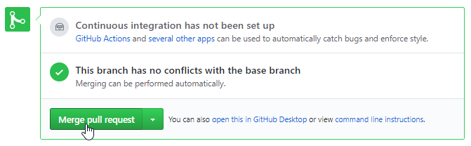
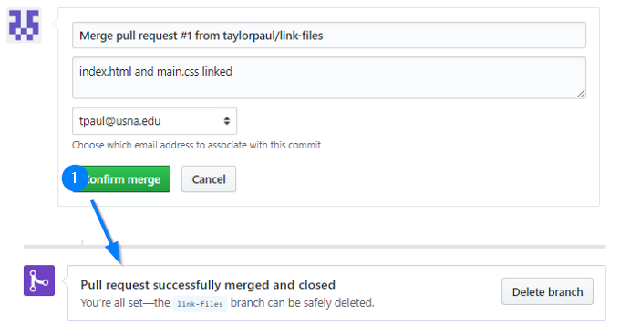
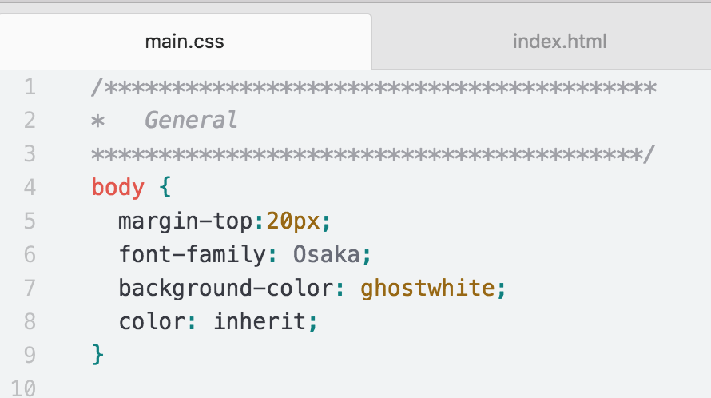
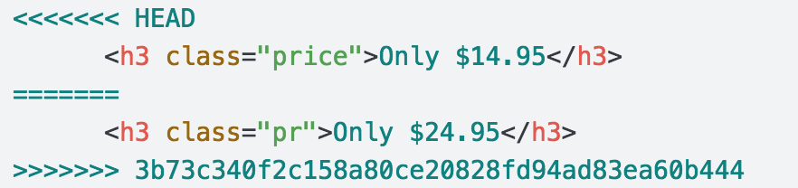

# Happy Fun Ball

## A Lesson on Git Branches and Merging
### Citations
This repository is a fork of GitHub User Krafalski's [hfb repository](https://github.com/Krafalski/hfb). Capt Taylor Paul made the original modification to port the repository and exercise to GitLab.

### Lesson Objectives
_After this lesson, students will be able to:_

- Explain how git's version control allows developers to work differently on projects
- Explain what a git branch is
- Make a git branch
- Switch between branches
- Merge branches
- Resolve a merge conflict

### Git Refresher
So far, you have been using git to get code (pull) from a remote repository (on GitLab), writing your own code, tracking it with git, and moving (push) the code from your computer (local version) to GitLab.

When using git locally (on your computer), you have been running the commands in Terminal (Command line).

A `git` command has a minimum of 1 argument.

Git commands are always executed by first typing `git`

The first argument is the command (or verb), like
- `git init` (initialize a new git repository)
- `git push` (send the code to a remote location)

The second(+) argument gives the first argument context (when needed)
- `git add <FILENAME>` (add all file with FILENAME)
- `git pull origin master` (get all files from the url that has an alias of `origin`, from the branch `master`)

Lastly, flags can be added
- `git remote -v` (git show remote(s) and be verbose(give more detail))

Here is a table of our commonly used git commands that we've used in this course so far:

| git | Argument | Flag(s)/Additional arguments | Description |
|:---:|:-----------:|:-------:|:-----------:|
| git | init |  |  Initializes a new repository|
| git | add | `.` or filename | Takes untracked files and adds them to the staging area so that they can be committed   |
| git | commit | -m 'some message'  |  Takes a snapshot of files in the staging area/ saves this version of them as a commit|
| git | remote | -v |  Shows the remote repositories associated with the local repository. Most repositories have an alias for their urls like `origin` or `upstream`|
| git | pull | upstream master |  Gets files from a url with an alias of `upstream` from its branch `master`|
| git | push | origin dev |  Sends files to a url with an alias of `origin` to its branch `dev`|
| git | log| --oneline |  Shows a log of commits of a repo (--oneline shows a truncated message)_`q` to exit_|
| git | status |  |  Shows the state of files in a repo (untracked, modified, staged)|

Note: `fork` is not on this list because `fork` is not a git command; it is a collaboration-site-specific (both GitHub and GitLab use `fork`) for copying a repository on GitLab to a new location on GitLab.

### Git VCS - Branches and Merging
Git is a VCS (Version Control System). There are a few popular ones, but git ends up being a top choice because of its *lightweight* branching and merging feature.

If you think back to past projects without git, when you wanted to implement some major changes to your code and failed your popular options were:
- `CTRL-Z` throughout our files and hope for the best
- Comment out a ton of code and hope to restore the functionality of our code to a previous version
- Seriously contemplate coding out our project from scratch again
- Curl up into a ball and hope the code would revert via magic

[Git's about page has 4 great reasons why it works so well for individuals and large teams.](https://git-scm.com/about)

- Frictionless Context Switching - Switch between branches, whenever! No worries!
- Role-Based code lines - Have many versions of your code - Production, Development, Day-to-Day etc.
- Feature Based Workflow - Create a new branch for each feature
- Disposable Experimentation - if a branch doesn't work out, you can just walk away or toss it. It has no impact on the working code

You may be thinking 'this sounds too good to be true!' It's not! But there is a catch! Git requires changing the way we typically work on projects. Which means it takes some time and practice to learn to use git.




### New Git Commands
To use branches, we will learn some new `git` commands

| git | Argument | Flag(s)/Additional arguments | Description |
|:---:|:-----------:|:-------:|:-----------:|
| git | branch |  |  Lists branches |
| git | branch | branch_name |  Creates a new branch |
| git | checkout | branch_name | Switches branches |
| git | checkout | -b new_branch_name  |  Creates a new branch and switches to that branch|
| git | diff |  |  Let's you see the changes that you have made (before `git add`)|

Even though these are just five new commands, it requires some practice to master them. Let's get started!

Note: You may have noticed that `git merge` is missing - we will be merging our branches via GitLab, so we will not use this command via the terminal.

## Scenario
You have been hired by Wacky Products Incorporated. They are just weeks away from starting a global marketing campaign for their new hot product Happy Fun Ball and they want a top-notch web page launched as soon as possible.

Mysteriously, the entire dev team has lapsed into comas and it is up to **you** to save the project.

As a professional developer, you will do whatever it takes to finish this project! Everything, *BUT* work directly on the master branch!


### Setup
#### Part 1 - Get the files
###### Browser - GitLab:
- Fork Happy-Fun-Ball (make a copy of this remote repository to your GitLab account):  
  - [Go here]( http://gitlab.cs.usna.edu/taylorpaul/branch_and_merge_exercise) and click `fork` (upper left) to fork it to your personal repo (Don't worry! You can delete it after the lesson if you can't stand clutter!)  
    -   

- Navigate to **YOUR** version on **YOUR** GitLab *branch_and_merge_exercise* repo  

- Click the *Copy URL to clipboard* button (on the right, beside `fork`)  
  - 

  - This will give you the option to copy the link to your clipboard and make it ready to paste in the command line.  

- REMEMBER: This should be from YOUR repo (the link to be copied should be `git@gitlab.cs.usna.edu:YOUR-GITLAB-HANDLE/branch_and_merge_exercise.git`)

###### Command line:
- Navigate to a directory **OUTSIDE** of any other git directories where you would liek to clone the *branch_and_merge_exercise* repo  

- Run this command in your terminal: ```$git clone `git@gitlab.cs.usna.edu:YOUR-GITLAB-HANDLE/branch_and_merge_exercise.git` ``` (use `CTRL-V` to paste the URL from GitLab)  

- The above command should create a new folder inside your current directory and make copy of everything in the Happy Fun Ball (branch_and_merge_exercise) remote repository, locally (on your computer) and initialize a new local git repository.
 Let's check:  

  - `cd branch_and_merge_exercise` into the cloned directory and then  

  - `ls` and check that  

    - `index.html` and  

    - `main.css` are in your folder (`README.md`, `LICENSE` & `img/` will also be there)  

  - `git status`  

    - <details><summary>Click for example terminal output</summary>
        `On branch master`  
        `Your branch is up-to-date with 'origin/master'.`  
        `nothing to commit, working tree clean`</details>  

  - `git remote -v` - to check your remote set up   

    -  <details><summary>Click for example terminal output</summary>  
  `origin git@gitlab.cs.usna.edu:YOUR-GITLAB-HANDLE/branch_and_merge_exercise.git (fetch)`  
   `origin git@gitlab.cs.usna.edu:YOUR-GITLAB-HANDLE/branch_and_merge_exercise.git (push)`</details>  

---

#### Part 2 - Make a Dev Branch
###### Command line:
To make a new branch AND checkout the new branch (we will call our new branch 'dev'):  

- `git checkout -b dev`  

  - <details><summary>Example output</summary>
    `Switched to a new branch 'dev'`</details>  

- `ls`  

    - `index.html` & `main.css`, etc. - should still be there  

- `git status` to confirm everything looks like it should  

  - <details><summary>Example output</summary>
    `On branch dev`  
    `nothing to commit, working tree clean`</details>  

- Now let's push this *new* local branch `dev` to your remote repo on GitLab:    

  - `git push origin dev`

    -  <details><summary>Example output</summary>
  ` * [new branch]      dev -> dev`</details>  

###### Browser - GitLab:
See your new dev branch on GitLab (it should be there, refresh the tab if you don't see it. If you still don't see it, let me know and we'll trouble shoot)
You will see a a new message along the top of GitLab and can also see the new change from clicking the drop-down arrow next to *master*:  




###### Command line:
- `atom .` open the files in atom  

- `open index.html` open index.html in the browser (remember you can do `open i` and then press `tab` to autocomplete index.html)

***

#### Part 3 - Organize yourself
We are going to be going between the browser, the command line and Atom frequently. Be sure you can work efficiently and effectively by setting up a good workflow! Start by organizing your browser, command line and Atom so that you can easily switch between them. Close extra tabs and browser windows.   

**Browser:**
- My repo
- Happy Fun Ball `index.html`
- README.md for this lesson
- Color Names (we'll be referring to this a few times, there is a link below)
- All other tabs are closed, no other Browser windows are open

**Atom:**
- directory tree (toggle view: `CTRL-\`).  
  -  See all Atom shortcuts : `CTRL-SHIFT-P` and type what you want to do!  
- index.html  
- main.css  

*Take a couple minutes to get familiar with the code you'll be working on.*

***

### New Feature - Link the HTML and CSS
Your first new feature!  Working in `index.html`, you will add a link to `main.css`, then you will merge it into the dev branch, and then into master.

#### Part 1 - Make a New Feature Branch off of `dev`
In general it is best practice to make a new branch for each bug you are fixing or feature you are adding in a git-based project. This prevents multiple editors (Did I mention some [projects](https://github.com/tensorflow/tensorflow) have tens of thousands of commits and more than 1,000 contributors?) from stepping on each other's toes and creating unnecessary *and dreaded* merge conflicts! Let's emulate the pro's here and do the same for our simple project. We will create a [second layer branch](http://i1.kym-cdn.com/photos/images/newsfeed/000/531/557/a88.jpg) from our already created `dev` branch and treat our `master` branch as the branch for production ready code!

###### Command line:
- Let's make a new branch specifically for our new feature
- `git branch` - to check that you are on the `dev` branch. This command will show all the branches and highlight the one you are on.

  - 

- `git checkout -b link-files` - this will create a new branch (a copy of the branch we are switching from, in this case: `dev`) called `link-files` and check it out
<details><summary>Example output:</summary>
`Switched to a new branch 'link-files'`
</details>

***

#### Part 2 - Work on New Feature
###### Atom - index.html :
- In the index.html - between the` </title>` and `</head>` tags, let's insert a link to our css :
- `<link rel="stylesheet" href="main.css">`
- `CTRL-S` - Save our changes in atom

###### Browser - index.html:
- `CTRL-R` - Reload our browser view of the `index.html`
- The CSS should now be loaded into our `index.html`

***

#### Part 3 - Feature Completed! Use Git to Track/Add it

###### Command line:
- `git status`
- `git add index.html`
- `git commit -m 'index.html and main.css linked'`
- `git push origin link-files`  (Remember: `origin`and `link-files` can be autocompeletd by using `tab`) <details><summary>Example output:</summary>
`Counting objects: 3, done.`  
`Delta compression using up to 12 threads.`  
`Compressing objects: 100% (3/3), done.`  
`Writing objects: 100% (3/3), 343 bytes | 0 bytes/s, done.`  
`Total 3 (delta 2), reused 0 (delta 0)`  
`remote:`  
`remote: To create a merge request for link-files, visit:`  
`remote:  `   `http://gitlab.cs.usna.edu/taylorpaul/branch_and_merge_exercise/merge_requests/new?merge_request%5Bsource_branch%5D=link-files`  
`To git@gitlab.cs.usna.edu:taylorpaul/branch_and_merge_exercise.git`  
` * [new branch]      link-files -> link-files`  
</details>
- Check GitLab to see that the new branch is there like we did above!

***

#### Part 4 - Merge New Feature into Dev Branch via GitLab
Git merging can be done both locally via the command line, or remotely using a `merge request` via GitLab (Note: a `merge request` on GitLab is equivalent to a `pull request` on GitHub, both are completing a merge of branches!). When working by yourself, when you have full permissions to all project branches, you will likely use the terminal to conduct your merges. When working on a collaboration project, where usually only a select group of people (like your Team Leader) have permission to merge into production branches, you will more often initiate a merge via GitLab and a `merge request`!  Let's start with the `merge request` method!


###### Browser - GitLab:
- See new `link-files` branch (either a message will pop up or if no message in view use the branch pull down to see)
  - ![Merge Request Screenshot]](img/gitlab_merge_request.png)


- You should see a blue `Create merge request` button as above. Click it!
- The title of your request matches your commit message by default, update it as you see fit.
- Add a longer description of what you accomplished on your branch if you desire.
- Explore some of the Assignee, [Milestone](https://docs.gitlab.com/ce/user/project/milestones/) and [Labels](https://docs.gitlab.com/ce/user/project/labels.html) features of GitLab, you can add as many of these as you desire.
- Make sure the Source branch (`link-files`) and Target branch (`dev`) make sense (match below). If not click `Change branches` and adjust necessary Source and Target branches:
  - 


- Go ahead and press the `Submit merge request` button, wait a moment and you should see a green `Merge` button about midway down the new page.
  - 


- Press the button, it will take a few seconds and you should see a success message!
  - 


<br>
 **Note:** When you work on a team it is unlikely that you would merge your own `merge requests`

 **Note:** You can refuse a merge and close the merge request by pressing the grey `Close merge request` button further down

 **Note:** After a successful merge, click the `Remove Source Branch` button to remove branches from the repo that are single feature branches. (i.e. you wouldn't ever remove the `dev` branch)

***

#### Part 5 - Get the Latest Remote Version of Dev, Locally
###### Command line:
- `git checkout dev` (Notice: no `-b`)

- `git pull origin dev`

- Check Atom (`index.html` has the link to CSS)
- Your browser view (`index.html` is displaying with CSS loaded - don't forget to `CTRL-R`/refresh your browser to be sure you are seeing the updated version)

- If everything looks good, let's merge these changes into the master branch using the terminal! **Note:** This is somewhat unrealistic... sorry. In an actual project you would likely use the Terminal to merge your feature branch (`link-files`) to your development branch (`dev`), because the permissions for these branches would be less restrictive, and then you would likely have to request permissions to merge the *tested and error free* development branch via a `merge request` on GitLab to send changes into the master branch for production.

***

#### Part 6 - Merge Dev Branch into Master via Terminal
###### Command line Double-Check:
- `git branch`: ensure you are on the `dev` branch (`git checkout dev` if *NOT*)

- `git pull origin master`: pulls any changes from origin (gitlab.cs.usna.edu) master (Your master branch in your project on GitLab) into your current branch (`dev`)

  - This should come back with "Already up-to-date" but it is a good habit to pull any updates from `master` since creating your branch of `dev` before you try and merge the `dev` branch back into `master`! **Please ask me for clarification if this doesn't make sense!**
  - <details><summary>Example output</summary>`From gitlab.cs.usna.edu:taylorpaul/branch_and_merge_exercise`  
    ` * branch            master     -> FETCH_HEAD`
    `Already up-to-date.`</details>


- `git push origin dev` (this should also come back as clean - since we have changed nothing in our code), it is good to get in the habit of checking yourself often!
 - <details><summary>Example output</summary>
   `Everything up-to-date`
   </details>

###### Command line Merge :
See the [git documentation](https://git-scm.com/docs/git-merge) for more information on the `merge` command! Now that we are sure everything is up-to-date, let's actually do our merge!
- `git checkout master` (Notice: no `-b`)
- `git pull origin master` (again just in case, note this command now affects our local `master` branch ONLY!)
- `git merge dev`
  - <details><summary>Example output (Note: You might have different number of changes!)</summary>
  `Updating b519be4..f8cd536`  
  `Fast-forward`  
  `index.html | 16 ++++++++++++++`  
  `1 file changed, 1 insertions(+), 1 deletions(-)`  

Now you should check your `master` branch on GitLab and in Atom to see that expected changes are present! Refresh your browser and you should see CSS applied to `index.html`!

***

### New Feature - Update the colors
 Work on a new feature: Working in the `main.css` file, you will update the colors of the Happy Fun Ball web page

###### Command line:
- Before we begin, let's make a new branch specifically for our new feature:
  - Check that you are on the dev branch **
  - `git branch` will list all your branches and have a `*` next to the branch you are on. Then:
  - `git checkout dev`
  - `git checkout -b color-updates`


  ** GOTCHA:** Branches can be created off any other branch. Be sure you are on the branch that you want to branch off of before creating a new branch!

###### Atom - index.html:
- You probably noticed that index.html had a typo! On (or around) line 19 `class="pr"` should actually be `class="price"`.
- Let's update that! (Don't forget `CTRL-S`/save) Now, it's not really our task, or our file to work on, but we're just being proactive and  helpful! What could possibly be wrong with that?

###### Command line:
- Let's go ahead and
- `git status`
- `git add index.html` and
- `git commit -m 'fixed typo in index.html'`, there! We added our changes and put in a descriptive commit message. We are undoubtedly awesome.

###### Atom - main.css:
- Now let's update the colors in the `body`, let's change `color` (font color), and `background-color` to whatever our heart desires. [Go ahead and use hexadecimal colors, rgb, hsl or some of the standard web colors.]( http://htmlcolorcodes.com/color-names/)

Make changes here in main.css 
- When we've found the colors we like, we can go ahead and
- `CTRL-S/save`

###### Command line:
- `git status` - see the status of our files
- `git diff` - see what we have changed
- `git add main.css` and
- `git commit -m 'updated colors'`
- `git log --oneline` -see our commits so far (`q` to exit)

### See Branching in Action
###### Command line:
- `git checkout dev` (Notice: no `-b`)

###### Atom - main.css:
- See that our changes are gone

###### Browser - index.html:
- Refresh the page and see that the page has reverted to the original version

Let's get back to our changes!
###### Command line:
- `git checkout color-updates` (don't forget you can use `tab` to autocomplete branch names too!)

Go through atom and the browser to see that your changes have come back

###### Atom - main.css:
- Let's make one more color change, now that we are on our color-updates branch. `.price` change the color from orange, to whatever color you want
- Can't find `.price`?
- `CTRL-F` will open a find/replace tab at the bottom of Atom and let you look for `.price`
- `esc` to close the find/replace tab
- make your changes (we are changing the color of elements with the class of `price`)
- `CTRL-S` -Don't forget to save your file
- Refresh your browser to see your changes
***
### Starting on a New Feature When We Haven't Finished Our Previous One
There was an error! The price of Happy Fun Ball is supposed to be $24.95, not $14.95!
<br>

**Let's make a new branch off of the dev branch to this major problem!**

###### Command line:
- `git checkout dev`<br>
- Oops! We forgot to `git add` & `git commit -m ""`!!


`error: Your local changes to the following files would be overwritten by checkout:` <br>
	`main.css` <br>
`Please commit your changes or stash them before you switch branches.` <br>
`Aborting`
- We will commit our changes (we will not cover `stash` today):
- `git add main.css`
- `git status`: just to be sure there weren't any other changes we made!
- `git commit -m 'changed .price color'`
- `git checkout dev`
- `git checkout -b price-fix` to make a new branch off of dev (and automatically be switched to the new branch)

###### Atom - index.hmtl:
- Update the price of happy fun ball from `$14.95` to `$24.95` (~ line 19 of `index.html`)
- `CTRL-S`/save

###### Command line:
- `git add index.html`
- `git commit -m 'fixed price of Happy Fun Ball in index.html'`
- `git pull origin dev` (this should come back clean, but it is good practice to pull before pushing)
- `git push origin price-fix` to create a new branch on GitLab

** GOTCHA:**  Branches can be created off any other branch. Be sure you are on the branch that you want to branch off of before creating a new branch!

***
### Merging Our New Feature into the Dev branch
###### Browser - GitLab:
- See our new branch
- Follow the instructions provided previously for creating a new `merge request`
- Wait a moment to let GitLab tell you if there are any merge conflicts
- All clear! Go ahead and press the `Merge` button (Note: when you work on a team, it is unlikely that you would accept your own merge requests)

***

### Going Back to Our Updated Colors Feature
- Whew! That was exciting! It's nice to be back to working on this feature. We know there were changes to the `dev` branch, so let's get them

###### Command line:
- `git checkout color-updates`
- `git pull origin dev` - to pull down your changes from the remote to your local copy

...

...

...

ERROR! Merge conflict! Example output:

`* branch            dev -> FETCH_HEAD`<br>
`c1df4fd..cc1ba3e  dev        -> origin/dev`<br>
`Auto-merging index.html` <br>
`CONFLICT (content): Merge conflict in index.html`<br>
`Automatic merge failed; fix conflicts and then commit the result.`

**Uh-oh...**

***

### Merge Conflict (and Resolution)!

###### Atom - index.html :

- View the conflict in Atom, the editor even gives you buttons for which change to keep! (Ours: Local, Theirs: Remote) **DON'T** use these buttons this time!



- Delete  everything between (including these lines as well) `<<<<<<< HEAD` and `========`

Which is ALL of this:

`<<<<<<< HEAD`<br>
      `<h3 class="price">Only $14.95</h3>`<br>
`=======` <br>


- This conflict is our doing, let's get rid of our mistake from working in index.html when we were only supposed to be working in main.css and keep the change made from the price-fix branch

- Now that we've removed the conflict let's finish cleaning up: fix `pr` to `price` again and remove the line:  
`>>>>>>> 3b73c340f2c158a80ce20828fd94ad83ea60b444`

*Note:* your numbers/letters after the `>>>>>>>` should be different
- Let's also clean up any extra white space
- `CTRL-S`

###### Command line:
- `git add index.html`
- `git commit -m 'fixed merge conflict'`
- `git push origin color-updates` <details><summary>Example output</summary>
`Counting objects: 11, done.`<br>
`Delta compression using up to 4 threads.`<br>
`Compressing objects: 100% (11/11), done.` <br>
`Writing objects: 100% (11/11), 1.05 KiB | 0 bytes/s, done.` <br>
`Total 11 (delta 7), reused 0 (delta 0)`<br>
`remote: Resolving deltas: 100% (7/7), completed with 3 local objects.`<br>
`To https://gitlab.cs.usna.edu/YOUR-GITLAB-HANDLE/branch_and_merge_exercise`<br>
` * [new branch]      color-updates -> color-updates`<br>
</details>

- We fixed it! Now we can continue working on our project

***
### Finishing and Merging Your Color Updates

###### Atom main.csss:
- Make your final updates to `main.css`

###### Command line:
- `git add main.css`
- `git commit -m 'updated colors'`
- `git push origin color-updates`

###### Browser - GitLab :
- Complete the steps covered previously to submit and accept a `merge request` via GitLab

###### Command line:
- `git checkout dev`
- `git pull origin dev`

###### Atom index.html/main.css :
- Take the time to review that the changes to the dev branch that you wanted are there and there are no errors or bugs
- **Only working code should ever be merged to master!**

- If everything is ok, go ahead and merge the changes to master
- If you made changes, don't forget to
- `git add` and
- `git commit -m ''`

###### Command line:
- `git pull origin dev` (yes, we _just_ did this, but it is a good habit to do a pull before doing a push. It is ok if git tells you `Already up-to-date` )
- `git push origin dev` (it is ok if git tells you that `Everything up-to-date`)

###### Browser - GitLab:
- Follow the steps covered previously to submit and accept a `merge request`
- Check to see that your changes have been successfully made to the master branch!

***

### Hungry for More?
- Make a new branch, continue to update the Happy Fun Ball web page, and merge back your changes (New Feature Ideas: change color of Happy Fun Ball. Add a google font. Add some js/jQuery to show/hide Happy Fun Ball's Warnings.)
- Research and try `git stash`
- Delete a branch locally and remotely:
  - Remotely: `git push origin --delete branch_name`
  - Locally: `git branch -d branch_name`
  - You can also do this in GitLab when you accept a `merge`


### Sudden and Permanent Shut Down of Wacky Products Incorporated
- Well, it was fun while it lasted?
